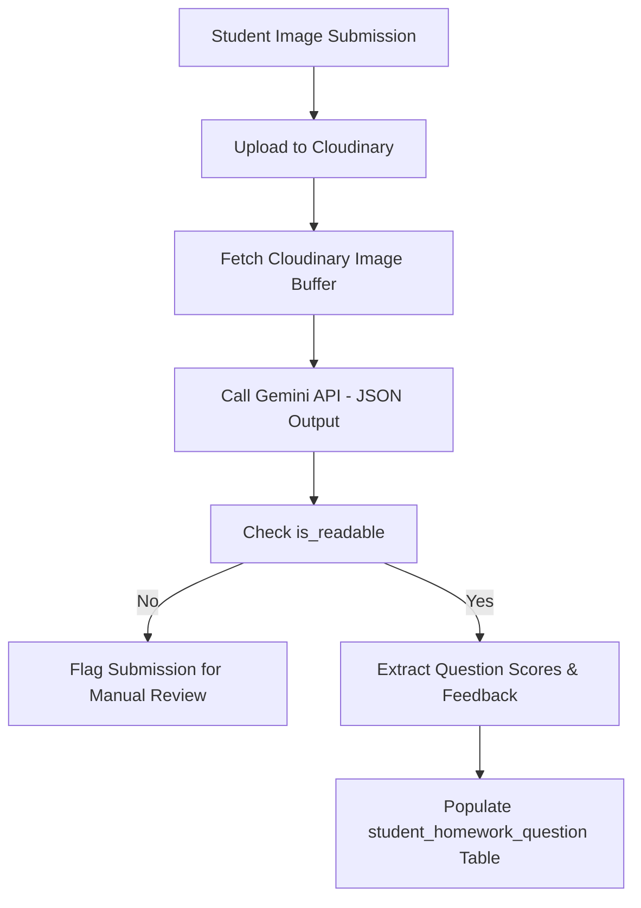

# TutorDesk - System Architecture

TutorDesk is a multi-tenant full-stack Class Management System built with a modern web stack on Next.js 15, React 19, and MySQL. It features granular role-based access control, real-time query caching, and automated AI grading powered by Google Gemini AI.

---

## 🛠️ Technology Stack

### Core Frameworks & Runtime
- **Next.js 15 (App Router)**: Hybrid server/client rendering model with Serverless API routes and App Routing.
- **React 19**: Modern declarative UI with Concurrent features.
- **TypeScript**: Static typing across both API and frontend surfaces.

### Styling & UI Components
- **Tailwind CSS v4**: Utility-first CSS compiling via PostCSS.
- **Lucide React**: Clean, lightweight icon suite.
- **React Quill (react-quill-new)**: Rich-text editing interface.

### State Management & Communication
- **TanStack Query (React Query) v5**: Server-state synchronization, request deduplication, and optimistic updates.
- **Axios**: Promised-based client HTTP requests.

### Database & Security
- **MySQL2**: Connection pooling and promise-based querying.
- **JOSE**: Lightweight JSON Web Token (JWT) signatures and verifications for middleware-level routing security.
- **Bcryptjs**: Strong hashing algorithm for credential encryption.

### AI & Media Integrations
- **Google Generative AI SDK (`@google/generative-ai`)**: Interfaces with Gemini (such as `gemini-2.5-flash-preview-09-2025`) for automated grading and content generation.
- **Cloudinary**: Object storage for homework image submissions.
- **Mammoth**: Node-native library for extracting raw content and converting `.docx` documents to HTML.

---

## 📂 Project Structure

```
├── public/                 # Static assets (images, fonts)
├── src/
│   ├── app/                # App Router Pages & API routes
│   │   ├── api/            # API endpoints (auth, hubs, classes, students, AI, etc.)
│   │   ├── auth/           # Login & Registration pages
│   │   └── dashboard/      # Hub dashboards (nested hub-specific layouts)
│   ├── components/         # Reusable UI components & modals
│   ├── context/            # React Contexts (Alert, auth context, etc.)
│   ├── hooks/              # Custom React Hooks
│   ├── lib/                # Database configuration, auth helpers, and permissions
│   ├── providers/          # Query Client and UI provider setups
│   ├── types/              # TypeScript interface & type declarations
│   └── utils/              # Helper utilities
├── README.md               # Standard getting-started guide
├── package.json            # Dependencies & build scripts
└── tsconfig.json           # Compiler rules
```

---

## 🔐 Authentication & Security Model

### JWT-Based Auth
Authentication is handled via JSON Web Tokens (JWT) signed with the `JOSE` library:
- **Storage**: Tokens are stored in HTTP-only, secure, `SameSite=Lax` cookies.
- **Verification**: Handled globally at the middleware layer (`src/middleware.ts`) and verified locally inside API endpoints using `getCurrentUser()`.

### Role-Based Access Control (RBAC)
TutorDesk implements a detailed permission mapping system based on a three-tier hierarchy:
1. **Owner**: Grants full control over the hub, members, settings, and billing.
2. **Master**: A managerial role capable of class management, student enrollments, and teacher assignments.
3. **Member**: Standard teacher or assistant access, limited to views and class records they are assigned to.

Permissions are checked dynamically in backend routes via the `checkPermission()` helper using permission tags such as `CREATE_HOMEWORK`, `TAKE_ATTENDANCE`, or `GRADE_HOMEWORK`.

---

## 💾 Database Schema

The database consists of the following key tables:
- **`user`**: Local accounts, storing credentials, profile details, and authentication metadata.
- **`hub`**: Tenancy model containing class groups, student lists, and workloads.
- **`hub_role`**: Maps users to hubs with roles (`Owner`, `Master`, `Member`).
- **`permissions`** & **`hub_permissions`**: Maps granular capability codes to user roles.
- **`class`**: Represents teaching groups, tuition packages, and schedules.
- **`schedule`**: Defines date/time recurring patterns for active classes.
- **`student`**: Student database associated with a specific hub.
- **`class_student`**: Junction table for enrolling students in classes.
- **`record_attendance`**: Tracks student attendance, class scores, and comments.
- **`homework`**: Stores rich-text instructions and answer keys.
- **`class_homework`**: Junction table representing homework assigned to a class.
- **`student_homework`**: Tracks homework submissions, student attachments (Cloudinary URLs), and grades.
- **`student_homework_question`**: Granular question-level feedback and marks generated by AI or adjusted by teachers.

---

## 🤖 AI grading & Content Flows

### AI Grading pipeline


### AI Answer Key generation
We leverage Gemini Flash for generating educational content. The workflow allows:
1. Converting local Word documents (.docx) to HTML via Mammoth.
2. Generating draft keys directly from homework HTML instructions.
3. Live editing of generated keys by instructors prior to saving to MySQL.
