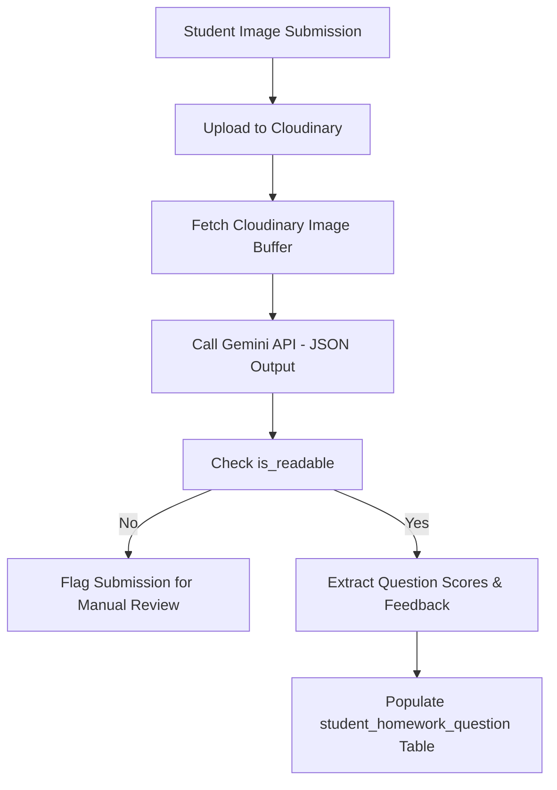

# TutorDesk - System Architecture

TutorDesk is a multi-tenant full-stack Class Management System built with a modern web stack on Next.js 15, React 19, and MySQL. It features granular role-based access control, real-time query caching, and automated AI grading powered by Google Gemini AI.

---

## 🛠️ Technology Stack

### Core Frameworks & Runtime
- **Next.js 15 (App Router)**: Hybrid server/client rendering model with Serverless API routes and App Routing.
- **React 19**: Modern declarative UI with Concurrent features.
- **TypeScript**: Static typing across both API and frontend surfaces.

### Styling & UI Components
- **Tailwind CSS v4**: Utility-first CSS compiling via PostCSS.
- **Lucide React**: Clean, lightweight icon suite.
- **React Quill (react-quill-new)**: Rich-text editing interface.

### State Management & Communication
- **TanStack Query (React Query) v5**: Server-state synchronization, request deduplication, and optimistic updates.
- **Axios**: Promised-based client HTTP requests.

### Database & Security
- **MySQL2**: Connection pooling and promise-based querying.
- **JOSE**: Lightweight JSON Web Token (JWT) signatures and verifications for middleware-level routing security.
- **Bcryptjs**: Strong hashing algorithm for credential encryption.

### AI & Media Integrations
- **Google Generative AI SDK (`@google/generative-ai`)**: Interfaces with Gemini (such as `gemini-2.5-flash-preview-09-2025`) for automated grading and content generation.
- **Cloudinary**: Object storage for homework image submissions.
- **Mammoth**: Node-native library for extracting raw content and converting `.docx` documents to HTML.

---

## 📂 Project Structure

```
├── public/                 # Static assets (images, fonts)
├── src/
│   ├── app/                # App Router Pages & API routes
│   │   ├── api/            # API endpoints (auth, hubs, classes, students, AI, etc.)
│   │   ├── auth/           # Login & Registration pages
│   │   └── dashboard/      # Hub dashboards (nested hub-specific layouts)
│   ├── components/         # Reusable UI components & modals
│   ├── context/            # React Contexts (Alert, auth context, etc.)
│   ├── hooks/              # Custom React Hooks
│   ├── lib/                # Database configuration, auth helpers, and permissions
│   ├── providers/          # Query Client and UI provider setups
│   ├── types/              # TypeScript interface & type declarations
│   └── utils/              # Helper utilities
├── README.md               # Standard getting-started guide
├── package.json            # Dependencies & build scripts
└── tsconfig.json           # Compiler rules
```

---

## 🔐 Authentication & Security Model

### JWT-Based Auth
Authentication is handled via JSON Web Tokens (JWT) signed with the `JOSE` library:
- **Storage**: Tokens are stored in HTTP-only, secure, `SameSite=Lax` cookies.
- **Verification**: Handled globally at the middleware layer (`src/middleware.ts`) and verified locally inside API endpoints using `getCurrentUser()`.

### Role-Based Access Control (RBAC)
TutorDesk implements a detailed permission mapping system based on a three-tier hierarchy:
1. **Owner**: Grants full control over the hub, members, settings, and billing.
2. **Master**: A managerial role capable of class management, student enrollments, and teacher assignments.
3. **Member**: Standard teacher or assistant access, limited to views and class records they are assigned to.

Permissions are checked dynamically in backend routes via the `checkPermission()` helper using permission tags such as `CREATE_HOMEWORK`, `TAKE_ATTENDANCE`, or `GRADE_HOMEWORK`.

---

## 💾 Database Schema

The database consists of 18 tables mapped as follows in the system's Entity-Relationship (ER) diagram, representing the multi-tenant relationships:

```mermaid
erDiagram
    user {
        int UserId PK
        varchar Name
        varchar Email UK
        text HashedPassword
        text Address
        varchar Phone
        tinyint IsAdmin
        enum Role
    }
    hub {
        int HubId PK
        varchar Name UK
        varchar Description
        tinyint IsDeleted
    }
    hub_role {
        int HubRoleId PK
        int HubId FK
        int UserId FK
        enum Role
        tinyint IsOwner
    }
    permissions {
        int PermissionId PK
        varchar Code UK
        text Description
    }
    hub_permissions {
        int HubRoleId PK, FK
        int PermissionId PK, FK
    }
    class {
        int ClassId PK
        varchar Name
        date StartDate
        date EndDate
        int TeacherUserId FK
        int AssistantUserId FK
        enum Status
        varchar Base
        decimal Tuition
        enum TuitionType
        varchar Subject
        int HubId FK
    }
    class_grade_weight {
        int ClassId PK, FK
        varchar Category PK
        decimal Weight
    }
    schedule {
        int ScheduleId PK
        enum DaysOfWeek
        time StartTime
        time EndTime
        int ClassId FK
    }
    student {
        int StudentId PK
        varchar Name
        date DateOfBirth
        date EnrollDate
        enum Status
        int HubId FK
        json FaceDescriptor
        text FaceImageUrl
        text FaceImagePublicId
    }
    class_student {
        int ClassStudentId PK
        int ClassId FK
        int StudentId FK
        date EnrollDate
    }
    record_attendance {
        int RecordAttendanceId PK
        enum Present
        int Score
        tinyint IsFinishHomework
        text Comment
        int StudentId FK
        int ClassId FK
        datetime AttendanceDate
        datetime UpdatedDate
        datetime CreatedDate
    }
    homework {
        int HomeworkId PK
        int HubId FK
        varchar Title
        text Content
        int CreatedByUserId FK
        datetime CreatedDate
        datetime UpdatedDate
        text AnswerKey
    }
    class_homework {
        int ClassHomeworkId PK
        int ClassId FK
        int HomeworkId FK
        date DueDate
        date AssignedDate
        varchar PublicIdForm UK
        tinyint IsFaceAuthEnabled
        varchar Type
    }
    student_homework {
        int StudentHomeworkId PK
        int ClassHomeworkId FK
        int StudentId FK
        datetime SubmittedDate
        enum Status
        decimal Grade
        text Feedback
        text UploadSubmission
        tinyint IsGraded
        datetime CreatedDate
        tinyint IsGradedByAI
        varchar SecurityStatus
        tinyint NeedsReview
        enum TimingStatus
    }
    student_homework_question {
        int StudentHomeworkQuestionId PK
        int StudentHomeworkId FK
        int QuestionNumber
        decimal Grade
        decimal MaxGrade
        text FeedBack
    }
    invoice {
        int InvoiceId PK
        int ClassId FK
        int StudentId FK
        tinyint IsPaid
        int Version
        decimal Amount
        date DueDate
        datetime CreatedDate
        datetime UpdatedDate
    }
    notification {
        int NotificationId PK
        int HubId FK
        int ClassId FK
        int SenderUserId FK
        varchar Title
        varchar Snippet
        text Content
        enum Category
        varchar Type
        varchar DeepLink
        datetime CreatedDate
    }
    notification_recipient {
        int NotificationRecipientId PK
        int NotificationId FK
        int RecipientUserId FK
        tinyint IsRead
        tinyint IsStarred
        tinyint IsDeleted
        datetime ReadDate
        datetime DeletedDate
        datetime CreatedDate
    }

    user ||--o{ class : "teaches (TeacherUserId)"
    user ||--o{ class : "assists (AssistantUserId)"
    user ||--o{ homework : "creates (CreatedByUserId)"
    user ||--o{ hub_role : "assigned (UserId)"
    user ||--o{ notification : "sends (SenderUserId)"
    user ||--o{ notification_recipient : "receives (RecipientUserId)"
    
    hub ||--o{ class : "contains (HubId)"
    hub ||--o{ homework : "contains (HubId)"
    hub ||--o{ hub_role : "has (HubId)"
    hub ||--o{ student : "contains (HubId)"
    hub ||--o{ notification : "contains (HubId)"

    hub_role ||--o{ hub_permissions : "defines (HubRoleId)"
    permissions ||--o{ hub_permissions : "grants (PermissionId)"

    class ||--o{ class_grade_weight : "defines (ClassId)"
    class ||--o{ class_homework : "assigns (ClassId)"
    class ||--o{ class_student : "enrolls (ClassId)"
    class ||--o{ invoice : "bills (ClassId)"
    class ||--o{ record_attendance : "tracks (ClassId)"
    class ||--o{ schedule : "scheduled_on (ClassId)"
    class ||--o{ notification : "scopes (ClassId)"

    student ||--o{ class_student : "enrolled_in (StudentId)"
    student ||--o{ invoice : "receives (StudentId)"
    student ||--o{ record_attendance : "attendance_for (StudentId)"
    student ||--o{ student_homework : "submits (StudentId)"

    homework ||--o{ class_homework : "assigned_as (HomeworkId)"
    class_homework ||--o{ student_homework : "has_submissions (ClassHomeworkId)"
    student_homework ||--o{ student_homework_question : "graded_by_questions (StudentHomeworkId)"
    notification ||--o{ notification_recipient : "dispatches (NotificationId)"
```

### 📋 Detailed Table Schemas

<details>
<summary><b>1. user</b> - Local accounts, storing credentials, profile details, and system roles.</summary>

| Column | Type | Nullable | Key / Constraint / Default | Description |
| :--- | :--- | :--- | :--- | :--- |
| `UserId` | `int` | No | `PRIMARY KEY`, `AUTO_INCREMENT` | Unique identifier for user |
| `Name` | `varchar(45)` | No | | User's display name |
| `Email` | `varchar(255)` | No | `UNIQUE` | User's login email |
| `HashedPassword` | `text` | No | | Encrypted password |
| `Address` | `text` | Yes | `DEFAULT NULL` | Physical address |
| `Phone` | `varchar(10)` | Yes | `DEFAULT NULL` | Phone number (10 characters max) |
| `IsAdmin` | `tinyint` | No | `DEFAULT '0'` | Administrator flag (1 = Admin, 0 = Regular) |
| `Role` | `enum('Teacher','Student','Admin')` | Yes | `DEFAULT NULL` | Base system authorization role |

</details>

<details>
<summary><b>2. hub</b> - Tenancy partitions containing class groups, students, and settings.</summary>

| Column | Type | Nullable | Key / Constraint / Default | Description |
| :--- | :--- | :--- | :--- | :--- |
| `HubId` | `int` | No | `PRIMARY KEY`, `AUTO_INCREMENT` | Unique identifier for hub |
| `Name` | `varchar(45)` | No | `UNIQUE` | Unique hub name |
| `Description` | `varchar(45)` | Yes | `DEFAULT NULL` | Optional descriptive label |
| `IsDeleted` | `tinyint` | Yes | `DEFAULT '0'` | Soft deletion flag |

</details>

<details>
<summary><b>3. hub_role</b> - Association mapping of users to hubs with tenancy roles.</summary>

| Column | Type | Nullable | Key / Constraint / Default | Description |
| :--- | :--- | :--- | :--- | :--- |
| `HubRoleId` | `int` | No | `PRIMARY KEY`, `AUTO_INCREMENT` | Unique role identifier |
| `HubId` | `int` | No | `FOREIGN KEY` to `hub(HubId)` | Associated hub |
| `UserId` | `int` | No | `FOREIGN KEY` to `user(UserId)` | Associated user |
| `Role` | `enum('Master','Member','Owner','Assistant','Teacher')` | No | | Role level inside the hub |
| `IsOwner` | `tinyint` | Yes | `DEFAULT '0'` | Flag indicating if user is the direct owner |

</details>

<details>
<summary><b>4. permissions</b> - Granular capability codes for access control check gates.</summary>

| Column | Type | Nullable | Key / Constraint / Default | Description |
| :--- | :--- | :--- | :--- | :--- |
| `PermissionId` | `int` | No | `PRIMARY KEY`, `AUTO_INCREMENT` | Unique permission identifier |
| `Code` | `varchar(45)` | No | `UNIQUE` | Short check string code (e.g. `TAKE_ATTENDANCE`) |
| `Description` | `text` | Yes | `DEFAULT NULL` | Explanation of permission capability |

</details>

<details>
<summary><b>5. hub_permissions</b> - Junction table mapping roles in a hub to specific permission codes.</summary>

| Column | Type | Nullable | Key / Constraint / Default | Description |
| :--- | :--- | :--- | :--- | :--- |
| `HubRoleId` | `int` | No | `PRIMARY KEY`, `FOREIGN KEY` to `hub_role(HubRoleId)` | Role to grant permission to |
| `PermissionId` | `int` | No | `PRIMARY KEY`, `FOREIGN KEY` to `permissions(PermissionId)` | Permission code granted |

</details>

<details>
<summary><b>6. class</b> - Teaching sections containing students, tuitions, and course metadata.</summary>

| Column | Type | Nullable | Key / Constraint / Default | Description |
| :--- | :--- | :--- | :--- | :--- |
| `ClassId` | `int` | No | `PRIMARY KEY`, `AUTO_INCREMENT` | Unique class identifier |
| `Name` | `varchar(45)` | No | | Display name of the class |
| `StartDate` | `date` | No | | Start date of class schedule |
| `EndDate` | `date` | No | | End date of class schedule |
| `TeacherUserId` | `int` | No | `FOREIGN KEY` to `user(UserId)` | Primary teacher for the class |
| `AssistantUserId` | `int` | Yes | `FOREIGN KEY` to `user(UserId)`, `DEFAULT NULL` | Optional teaching assistant |
| `Status` | `enum('Active','Finished')` | No | `DEFAULT 'Active'` | Class status lifecycle |
| `Base` | `varchar(100)` | Yes | `DEFAULT NULL` | Classroom base location / online URL |
| `Tuition` | `decimal(15,0)` | No | | Fee amount billed per cycle |
| `TuitionType` | `enum('Monthly','Quarter','Course','Flexible')` | No | | Billing cycle type |
| `Subject` | `varchar(255)` | No | | Subject name/tag |
| `HubId` | `int` | No | `FOREIGN KEY` to `hub(HubId)` | Hub hosting the class |

</details>

<details>
<summary><b>7. class_grade_weight</b> - Categorized weight distributions for calculating final grades.</summary>

| Column | Type | Nullable | Key / Constraint / Default | Description |
| :--- | :--- | :--- | :--- | :--- |
| `ClassId` | `int` | No | `PRIMARY KEY` | Associated class |
| `Category` | `varchar(50)` | No | `PRIMARY KEY` | Category label (e.g. `Homework`, `Midterm`) |
| `Weight` | `decimal(5,2)` | No | | Grade calculation weight (percentage representation) |

</details>

<details>
<summary><b>8. schedule</b> - Reoccurring class session days and times.</summary>

| Column | Type | Nullable | Key / Constraint / Default | Description |
| :--- | :--- | :--- | :--- | :--- |
| `ScheduleId` | `int` | No | `PRIMARY KEY`, `AUTO_INCREMENT` | Unique schedule identifier |
| `DaysOfWeek` | `enum('Monday',...)` | No | | Days when the class meets |
| `StartTime` | `time` | No | | Class start time |
| `EndTime` | `time` | No | | Class end time |
| `ClassId` | `int` | No | `FOREIGN KEY` to `class(ClassId)` | Associated class |

</details>

<details>
<summary><b>9. student</b> - Student database and associated biometrics (face scanning).</summary>

| Column | Type | Nullable | Key / Constraint / Default | Description |
| :--- | :--- | :--- | :--- | :--- |
| `StudentId` | `int` | No | `PRIMARY KEY`, `AUTO_INCREMENT` | Unique student identifier |
| `Name` | `varchar(45)` | No | | Full name of the student |
| `DateOfBirth` | `date` | Yes | `DEFAULT NULL` | Date of birth |
| `EnrollDate` | `date` | Yes | `DEFAULT NULL` | General registration date |
| `Status` | `enum('Studying','Finished')` | Yes | `DEFAULT 'Studying'` | Current studying status |
| `HubId` | `int` | No | | Hub managing the student |
| `FaceDescriptor` | `json` | Yes | `DEFAULT NULL` | Extracted face biometric descriptor array |
| `FaceImageUrl` | `text` | Yes | `DEFAULT NULL` | Image URL of reference photo in Cloudinary |
| `FaceImagePublicId` | `text` | Yes | `DEFAULT NULL` | Public ID of reference photo in Cloudinary |

</details>

<details>
<summary><b>10. class_student</b> - Junction table tracking student enrollments in specific classes.</summary>

| Column | Type | Nullable | Key / Constraint / Default | Description |
| :--- | :--- | :--- | :--- | :--- |
| `ClassStudentId` | `int` | No | `PRIMARY KEY`, `AUTO_INCREMENT` | Unique enrollment identifier |
| `ClassId` | `int` | No | `FOREIGN KEY` to `class(ClassId)`, `UNIQUE(ClassId, StudentId)` | Associated class |
| `StudentId` | `int` | No | `FOREIGN KEY` to `student(StudentId)`, `UNIQUE(ClassId, StudentId)` | Associated student |
| `EnrollDate` | `date` | Yes | `DEFAULT NULL` | Date the student enrolled in this class |

</details>

<details>
<summary><b>11. record_attendance</b> - Tracks class session attendance status, scores, and homework validation.</summary>

| Column | Type | Nullable | Key / Constraint / Default | Description |
| :--- | :--- | :--- | :--- | :--- |
| `RecordAttendanceId` | `int` | No | `PRIMARY KEY`, `AUTO_INCREMENT` | Unique record identifier |
| `Present` | `enum('Present','Absent','Excused','Late','Unchecked')` | No | | Attendance status |
| `Score` | `int` | Yes | `DEFAULT NULL` | Session participation score |
| `IsFinishHomework` | `tinyint` | Yes | `DEFAULT NULL` | Status indicating if session homework was completed |
| `Comment` | `text` | Yes | `DEFAULT NULL` | Instructor notes/feedback |
| `StudentId` | `int` | No | `FOREIGN KEY` to `student(StudentId)`, `UNIQUE(StudentId, ClassId, AttendanceDate)` | Associated student |
| `ClassId` | `int` | No | `FOREIGN KEY` to `class(ClassId)`, `UNIQUE(StudentId, ClassId, AttendanceDate)` | Associated class |
| `AttendanceDate` | `datetime` | No | `DEFAULT CURRENT_TIMESTAMP` | Date of attendance session |
| `UpdatedDate` | `datetime` | No | `DEFAULT CURRENT_TIMESTAMP` | Last updated timestamp |
| `CreatedDate` | `datetime` | No | `DEFAULT CURRENT_TIMESTAMP` | Created timestamp |

</details>

<details>
<summary><b>12. homework</b> - Stores master homework text templates and corresponding answer keys.</summary>

| Column | Type | Nullable | Key / Constraint / Default | Description |
| :--- | :--- | :--- | :--- | :--- |
| `HomeworkId` | `int` | No | `PRIMARY KEY`, `AUTO_INCREMENT` | Unique homework identifier |
| `HubId` | `int` | No | `FOREIGN KEY` to `hub(HubId)` | Hub template library it belongs to |
| `Title` | `varchar(255)` | Yes | `DEFAULT NULL` | Title of the assignment |
| `Content` | `text` | Yes | `DEFAULT NULL` | Detailed guidelines or HTML description |
| `CreatedByUserId` | `int` | No | `FOREIGN KEY` to `user(UserId)` | User who designed the homework template |
| `CreatedDate` | `datetime` | Yes | `DEFAULT CURRENT_TIMESTAMP` | Creation time |
| `UpdatedDate` | `datetime` | Yes | `DEFAULT NULL` | Modification time |
| `AnswerKey` | `text` | Yes | `DEFAULT NULL` | Standard solution or criteria used for AI grading |

</details>

<details>
<summary><b>13. class_homework</b> - Instances of homework assigned to specific classes with deadlines.</summary>

| Column | Type | Nullable | Key / Constraint / Default | Description |
| :--- | :--- | :--- | :--- | :--- |
| `ClassHomeworkId` | `int` | No | `PRIMARY KEY`, `AUTO_INCREMENT` | Unique assignment identifier |
| `ClassId` | `int` | No | `FOREIGN KEY` to `class(ClassId)` | Assigned class |
| `HomeworkId` | `int` | No | `FOREIGN KEY` to `homework(HomeworkId)` | Source homework template |
| `DueDate` | `date` | No | | Submission deadline |
| `AssignedDate` | `date` | No | | Date assignment became active |
| `PublicIdForm` | `varchar(5)` | No | `UNIQUE` | 5-character short URL code for students |
| `IsFaceAuthEnabled` | `tinyint` | No | `DEFAULT '0'` | Flag forcing student biometric confirmation |
| `Type` | `varchar(45)` | Yes | `DEFAULT 'Homework'` | Assignment type category (e.g. `Homework`, `Test`) |

</details>

<details>
<summary><b>14. student_homework</b> - Individual student submissions and final graded scores.</summary>

| Column | Type | Nullable | Key / Constraint / Default | Description |
| :--- | :--- | :--- | :--- | :--- |
| `StudentHomeworkId` | `int` | No | `PRIMARY KEY`, `AUTO_INCREMENT` | Unique submission identifier |
| `ClassHomeworkId` | `int` | No | `FOREIGN KEY` to `class_homework(ClassHomeworkId)`, `UNIQUE(ClassHomeworkId, StudentId)` | Associated class homework |
| `StudentId` | `int` | No | `FOREIGN KEY` to `student(StudentId)`, `UNIQUE(ClassHomeworkId, StudentId)` | Associated student |
| `SubmittedDate` | `datetime` | Yes | `DEFAULT NULL` | Exact timestamp of student submission |
| `Status` | `enum('Pending','Submitted','Missed')` | Yes | `DEFAULT 'Pending'` | Workflow submission status |
| `Grade` | `decimal(5,2)` | Yes | `DEFAULT NULL` | Calculated final grade (out of 10 or 100) |
| `Feedback` | `text` | Yes | `DEFAULT NULL` | Teacher or AI summary comments |
| `UploadSubmission` | `text` | Yes | `DEFAULT NULL` | Path/URL to submitted documents (Cloudinary URLs) |
| `IsGraded` | `tinyint` | No | `DEFAULT '0'` | Grading completion flag |
| `CreatedDate` | `datetime` | No | `DEFAULT CURRENT_TIMESTAMP` | Record instantiation timestamp |
| `IsGradedByAI` | `tinyint` | No | `DEFAULT '0'` | Flag indicating if Gemini calculated the initial grade |
| `SecurityStatus` | `varchar(20)` | Yes | `DEFAULT 'None'` | Security check result (e.g., face match status) |
| `NeedsReview` | `tinyint(1)` | Yes | `DEFAULT '0'` | Flag for manual teacher audit or unreadable files |
| `TimingStatus` | `enum('InTime','Overdue')` | Yes | `DEFAULT NULL` | Timeliness tracking |

</details>

<details>
<summary><b>15. student_homework_question</b> - Granular question-level scores and feedback generated by AI.</summary>

| Column | Type | Nullable | Key / Constraint / Default | Description |
| :--- | :--- | :--- | :--- | :--- |
| `StudentHomeworkQuestionId` | `int` | No | `PRIMARY KEY`, `AUTO_INCREMENT` | Unique question grade identifier |
| `StudentHomeworkId` | `int` | No | `FOREIGN KEY` to `student_homework(StudentHomeworkId)`, `UNIQUE(StudentHomeworkId, QuestionNumber)` | Associated student submission |
| `QuestionNumber` | `int` | Yes | | Sequential index of question (1, 2, 3...) |
| `Grade` | `decimal(3,1)` | Yes | `DEFAULT NULL` | Awarded grade for this question |
| `MaxGrade` | `decimal(3,0)` | Yes | `DEFAULT NULL` | Maximum points possible for this question |
| `FeedBack` | `text` | Yes | `DEFAULT NULL` | Detailed review / explanation for the question grade |

</details>

<details>
<summary><b>16. invoice</b> - Billing ledger items for tuition tracking.</summary>

| Column | Type | Nullable | Key / Constraint / Default | Description |
| :--- | :--- | :--- | :--- | :--- |
| `InvoiceId` | `int` | No | `PRIMARY KEY`, `AUTO_INCREMENT` | Unique invoice identifier |
| `ClassId` | `int` | Yes | `FOREIGN KEY` to `class(ClassId)`, `DEFAULT NULL` | Associated class billed |
| `StudentId` | `int` | No | `FOREIGN KEY` to `student(StudentId)` | Associated student |
| `IsPaid` | `tinyint` | No | | Payment confirmation status (1 = Paid, 0 = Unpaid) |
| `Version` | `int` | No | | Sequential billing cycle installment index |
| `Amount` | `decimal(15,0)` | No | | Total fee value billed |
| `DueDate` | `date` | No | | Payment deadline |
| `CreatedDate` | `datetime` | No | | Creation date |
| `UpdatedDate` | `datetime` | No | | Last updated timestamp |

</details>

<details>
<summary><b>17. notification</b> - Stores core notification details, category types, and deep links.</summary>

| Column | Type | Nullable | Key / Constraint / Default | Description |
| :--- | :--- | :--- | :--- | :--- |
| `NotificationId` | `int` | No | `PRIMARY KEY`, `AUTO_INCREMENT` | Unique identifier |
| `HubId` | `int` | No | `FOREIGN KEY` to `hub(HubId)` | Hub where the event occurred |
| `ClassId` | `int` | Yes | `FOREIGN KEY` to `class(ClassId)`, `DEFAULT NULL` | Class the notification belongs to (null if global) |
| `SenderUserId` | `int` | Yes | `FOREIGN KEY` to `user(UserId)`, `DEFAULT NULL` | Optional user who sent the notification (null if System) |
| `Title` | `varchar(255)` | No | | Alert subject line |
| `Snippet` | `varchar(500)` | No | | Brief description shown in lists |
| `Content` | `text` | No | | Detailed HTML block body |
| `Category` | `enum('homework','class','system')` | No | | Organization drawer filter |
| `Type` | `varchar(50)` | No | | Custom type string (e.g. `submission_received`) |
| `DeepLink` | `varchar(255)` | Yes | `DEFAULT NULL` | URL path redirect destination |
| `CreatedDate` | `datetime` | No | `DEFAULT CURRENT_TIMESTAMP` | Alert creation timestamp |

</details>

<details>
<summary><b>18. notification_recipient</b> - Multi-recipient mapping tracking read, star, and soft-delete states.</summary>

| Column | Type | Nullable | Key / Constraint / Default | Description |
| :--- | :--- | :--- | :--- | :--- |
| `NotificationRecipientId` | `int` | No | `PRIMARY KEY`, `AUTO_INCREMENT` | Unique dispatch mapping ID |
| `NotificationId` | `int` | No | `FOREIGN KEY` to `notification(NotificationId)` | Source notification |
| `RecipientUserId` | `int` | No | `FOREIGN KEY` to `user(UserId)` | Recipient user |
| `IsRead` | `tinyint` | No | `DEFAULT '0'` | Read status flag |
| `IsStarred` | `tinyint` | No | `DEFAULT '0'` | Starred bookmark status flag |
| `IsDeleted` | `tinyint` | No | `DEFAULT '0'` | Moved to trash status flag |
| `ReadDate` | `datetime` | Yes | `DEFAULT NULL` | Timestamp of read action |
| `DeletedDate` | `datetime` | Yes | `DEFAULT NULL` | Timestamp of trash action |
| `CreatedDate` | `datetime` | No | `DEFAULT CURRENT_TIMESTAMP` | Dispatch timestamp |

</details>

#### 📝 Architectural Context: Why the `Version` Field Exists in the `invoice` Table
In the TutorDesk domain model, a class can have recurring billing (e.g., Monthly or Quarterly tuition) rather than just a single upfront course fee. 

The `Version` column represents the sequential **Billing Cycle / Tuition Period** for a student enrolled in a specific class. 

For example:
- `Version = 1`: Tuition for Month 1 (or Quarter 1 / Initial Course fee).
- `Version = 2`: Tuition for Month 2 (or Quarter 2).
- `Version = 3`: Tuition for Month 3 (or Quarter 3).

1. **Differentiating Recurring Invoices**: Because a student stays in the same class across multiple billing cycles, a single `StudentId` + `ClassId` combination will generate multiple rows in the `invoice` table over time. Without `Version`, the system cannot uniquely identify which specific cycle installment an invoice belongs to.
2. **Ensuring Idempotency & Preventing Duplicate Billing**: When automated billing cron jobs evaluate classes, they check for the existence of `(ClassId, StudentId, Version)` to ensure a student is billed exactly once per cycle.
3. **State & Feature Gating**: Checking payment status for the current active period is clean:
   `SELECT IsPaid FROM invoice WHERE ClassId = ? AND StudentId = ? AND Version = ?`

---

## 🤖 AI grading & Content Flows

### AI Grading pipeline


### AI Answer Key generation
We leverage Gemini Flash for generating educational content. The workflow allows:
1. Converting local Word documents (.docx) to HTML via Mammoth.
2. Generating draft keys directly from homework HTML instructions.
3. Live editing of generated keys by instructors prior to saving to MySQL.

---

## 🔄 Frontend State Synchronization

To interact with the MySQL backend, React client components consume TanStack Query hooks that encapsulate REST operations and handle cache invalidation.

### Notification Synchronization Flow
- **`useGetNotifications`**: Queries the `/api/hub/[hub_id]/notifications` endpoint, caching the notification list using the `['notifications', hubId]` key.
- **`useUpdateNotifications`**: Dispatches `PATCH` actions (`read`, `unread`, `star`, `unstar`, `trash`, `restore`) to the backend API, invalidating the `['notifications', hubId]` cache key upon success to trigger automated background re-fetching.

