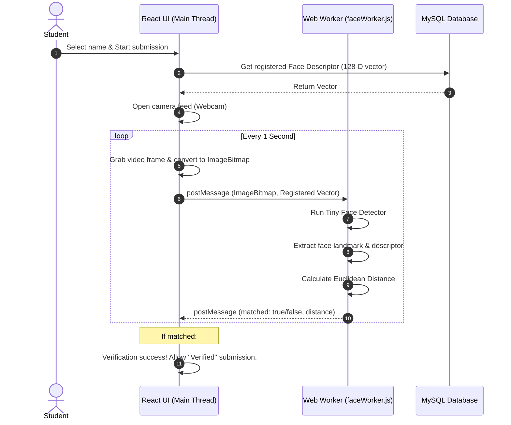

# 🛡️ Cấu trúc Bài thuyết trình: Face Security in TutorDesk

Tài liệu này đã được sắp xếp lại đúng theo trình tự bạn yêu cầu:
1. **What did I use to implement this?** (Những công nghệ đã sử dụng)
2. **How?** (Cách thức hoạt động, chi tiết về Web Worker, Mocking DOM và đối chiếu)
3. **Why?** (Tại sao phải làm như vậy: hiệu năng, kiến trúc, tính khả thi)

Slide được viết bằng **tiếng Anh** (chuẩn để chiếu slide) và phần **Speaker Notes** (Lời thoại gợi ý) được viết bằng **tiếng Việt** để bạn dễ dàng trình bày.

---

<!-- slide -->

# 1. WHAT DID I USE TO IMPLEMENT THIS? (Công nghệ sử dụng)

## 💻 Core Technologies & Frameworks
*   **Next.js (React + TypeScript)**: The backbone framework hosting both UI pages and REST API endpoints.
*   **`face-api.js` (under the hood: TensorFlow.js)**: A lightweight Javascript library running pre-trained convolutional neural networks (CNNs) directly in the browser.
*   **HTML5 Web Workers API**: Background threading mechanism enabling multi-threaded JavaScript execution.

## 🖼️ Media & Browser APIs
*   **MediaDevices API (`getUserMedia`)**: To capture real-time webcam video stream from the student's device.
*   **`OffscreenCanvas` & `ImageBitmap`**: High-performance graphics APIs that allow canvas rendering and frame transferring outside the main UI thread.

## 🗄️ Database & Cloud Storage
*   **MySQL**: Relational database storing student records and the **128-dimensional Float32Array vector** (Face Descriptor) as a JSON string.
*   **Cloudinary**: Cloud storage used to host student reference face photographs securely.

---
> **Speaker Notes (Lời thoại gợi ý - Tiếng Việt):**
> *   *Chào mọi người, phần đầu tiên mình muốn nói về những công nghệ và công cụ mình đã sử dụng để hiện thực hóa tính năng Face Security này.*
> *   *Về framework chính, mình dùng Next.js kết hợp TypeScript cho cả phần giao diện (UI) và các API backend.*
> *   *Để nhận diện khuôn mặt trực tiếp trên trình duyệt, mình sử dụng thư viện `face-api.js` chạy trên nền tảng TensorFlow.js. Nó giúp chạy các mô hình AI trực tiếp ở phía client.*
> *   *Để xử lý các phép toán AI nặng mà không gây lag máy, mình đã sử dụng Web Workers API của HTML5 để tạo ra một luồng chạy ngầm riêng.*
> *   *Ngoài ra, để lấy dữ liệu camera, mình dùng `navigator.mediaDevices`. Để tối ưu hóa việc gửi từng khung ảnh từ camera vào luồng ngầm, mình dùng định dạng `ImageBitmap` kết hợp với `OffscreenCanvas`.*
> *   *Cuối cùng, dữ liệu vector khuôn mặt (128 số thực) được lưu trong MySQL, còn ảnh gốc của học sinh được upload lên Cloudinary.*

---

<!-- slide -->

# 2. HOW? - SYSTEM FLOW (Cách thức hoạt động)



---
> **Speaker Notes (Lời thoại gợi ý - Tiếng Việt):**
> *   *Đây là quy trình hoạt động tổng quan của hệ thống khi học sinh nộp bài:*
> *   *Bước 1: Khi học sinh chọn tên của mình trên form nộp bài công khai, hệ thống sẽ gọi API xuống MySQL lấy về chuỗi vector khuôn mặt (gồm 128 số) đã đăng ký trước đó của học sinh đó.*
> *   *Bước 2: Hệ thống bật webcam lên.*
> *   *Bước 3: Cứ mỗi 1 giây, luồng giao diện chính (Main Thread) sẽ chụp lại 1 khung hình từ video camera, chuyển thành dạng `ImageBitmap` và gửi nó xuống Web Worker.*
> *   *Bước 4: Tại đây, Web Worker sẽ tự chạy nhận diện khuôn mặt trên khung hình đó, trích xuất ra vector khuôn mặt hiện tại rồi so sánh với vector đăng ký ban đầu thông qua công thức toán học Euclidean Distance.*
> *   *Bước 5: Web Worker trả kết quả so khớp về giao diện chính. Nếu khớp (khoảng cách nhỏ hơn 0.5), hệ thống báo thành công, tắt camera và đánh dấu bài nộp này là "Verified" (Đã xác minh).*

---

<!-- slide -->

# 2. HOW? - DEEP DIVE: WEB WORKER & DOM MOCKING

*   **The Web Worker Constraint**: Web Workers execute in an isolated global scope (`self`). They **do not** have access to the DOM, `window`, `document`, or standard HTML elements.
*   **The Library Crash**: `face-api.js` expects a browser environment and crashes immediately inside workers because checks like `typeof CanvasRenderingContext2D !== 'undefined'` return `false`.
*   **Our Solution (Environment Mocking)**: Before loading the library in `faceWorker.js`, we mock the browser environment on `self`:

```javascript
// Mock the browser environment in the Worker
const mock = () => {
    self.window = self;
    self.document = {
        createElement: (name) => {
            if (name.toLowerCase() === 'canvas') return new OffscreenCanvas(640, 480);
            return { style: {} };
        },
        querySelectorAll: () => [],
        getElementById: () => null,
        getElementsByTagName: () => []
    };
    self.HTMLImageElement = class HTMLImageElement {};
    self.HTMLCanvasElement = class HTMLCanvasElement {};
    self.HTMLVideoElement = class HTMLVideoElement {};
    self.CanvasRenderingContext2D = class CanvasRenderingContext2D {};
    self.ImageData = self.ImageData || class ImageData {};
};
mock();
importScripts('https://cdn.jsdelivr.net/npm/@vladmandic/face-api/dist/face-api.js');
```

---
> **Speaker Notes (Lời thoại gợi ý - Tiếng Việt):**
> *   *Để chạy được nhận diện khuôn mặt dưới Worker, mình đã phải giải quyết một bài toán kỹ thuật khá thú vị.*
> *   *Mặc định, Web Worker chạy độc lập, hoàn toàn không có đối tượng `window` hay `document` (DOM). Trong khi đó, thư viện `face-api.js` được viết cho trình duyệt nên nó sẽ kiểm tra xem các class như `HTMLCanvasElement` hay `CanvasRenderingContext2D` có tồn tại không. Nếu không có, nó sẽ crash ngay lập tức.*
> *   *Giải pháp của mình là viết một hàm `mock()` ngay đầu file `faceWorker.js` để định nghĩa giả lập các class và biến này trên phạm vi toàn cục của Worker.*
> *   *Đặc biệt, hàm tạo thẻ canvas giả lập `createElement('canvas')` sẽ trả về một đối tượng `OffscreenCanvas` thực tế chạy được ở luồng ngầm.*
> *   *Nhờ vậy, khi gọi `importScripts` tải thư viện `face-api.js` vào, nó nhận diện môi trường hoàn toàn bình thường và hoạt động trơn tru.*

---

<!-- slide -->

# 3. WHY? (Tại sao thiết kế như vậy?)

## 🎛️ Why Web Workers? (Performance)
*   **Prevent UI Freezing**: Neural Network inference is single-threaded and takes 150ms-300ms per frame. Running this on the main thread freezes the camera feed, form inputs, and animations.
*   **Multithreading**: Offloads the mathematical computation to a background thread, maintaining a constant **60 FPS** on the UI.

## 🔒 Why Local Client-Side AI? (Privacy & Cost)
*   **Privacy**: Students' raw webcam video streams **never** leave their device. Only the processed 128-D anonymous text vector is sent to the database.
*   **No Server Load**: The heavy computation is distributed across the students' devices, meaning zero CPU/GPU server costs for our hosting backend.

## ⚖️ Why Soft-Verification (Verified vs. Unverified)? (Accessibility)
*   **Inclusive Design**: Students without functional webcams or those who haven't registered their face can still submit homework.
*   **Teacher Control**: The system marks their submission status as `'Unverified'`, alerting the teacher in the gradebook to review the submission manually, ensuring nobody is locked out of their education.

---
> **Speaker Notes (Lời thoại gợi ý - Tiếng Việt):**
> *   *Phần cuối cùng là: Tại sao chúng ta lại thiết kế hệ thống theo cách này?*
> *   *Thứ nhất, tại sao dùng Web Worker? Nhận diện AI rất nặng, mất khoảng 150ms đến 300ms cho mỗi khung hình. Nếu chạy trên luồng chính, giao diện sẽ bị đơ cứng, camera bị giật hình. Đưa xuống Worker giúp trang web mượt mà ở mức 60 FPS.*
> *   *Thứ hai, tại sao lại nhận diện ở phía Client chứ không gửi ảnh lên Server để nhận diện?*
>     *   *Để bảo vệ quyền riêng tư: ảnh từ webcam của học sinh không bao giờ bị gửi lên server, tất cả xử lý đều nằm trên máy của họ.*
>     *   *Để tiết kiệm chi phí: server của chúng ta không cần gánh các tác vụ xử lý AI nặng nề, nhờ đó giảm thiểu chi phí vận hành backend về mức tối thiểu.*
> *   *Thứ ba, tại sao cho phép nộp bài khi chưa xác thực thành công (Unverified)?*
>     *   *Chúng ta không nên chặn học sinh nộp bài chỉ vì camera của họ bị hỏng hoặc chưa đăng ký khuôn mặt.*
>     *   *Hệ thống sẽ gắn cờ 'Unverified' trên bảng điểm của giáo viên. Giáo viên sẽ biết bài nộp nào chưa xác thực khuôn mặt để tự kiểm tra thủ công.*
> *   *Đó là toàn bộ những công nghệ, cách làm và lý do vì sao mình xây dựng hệ thống Face Security này. Cảm ơn mọi người đã lắng nghe!*
